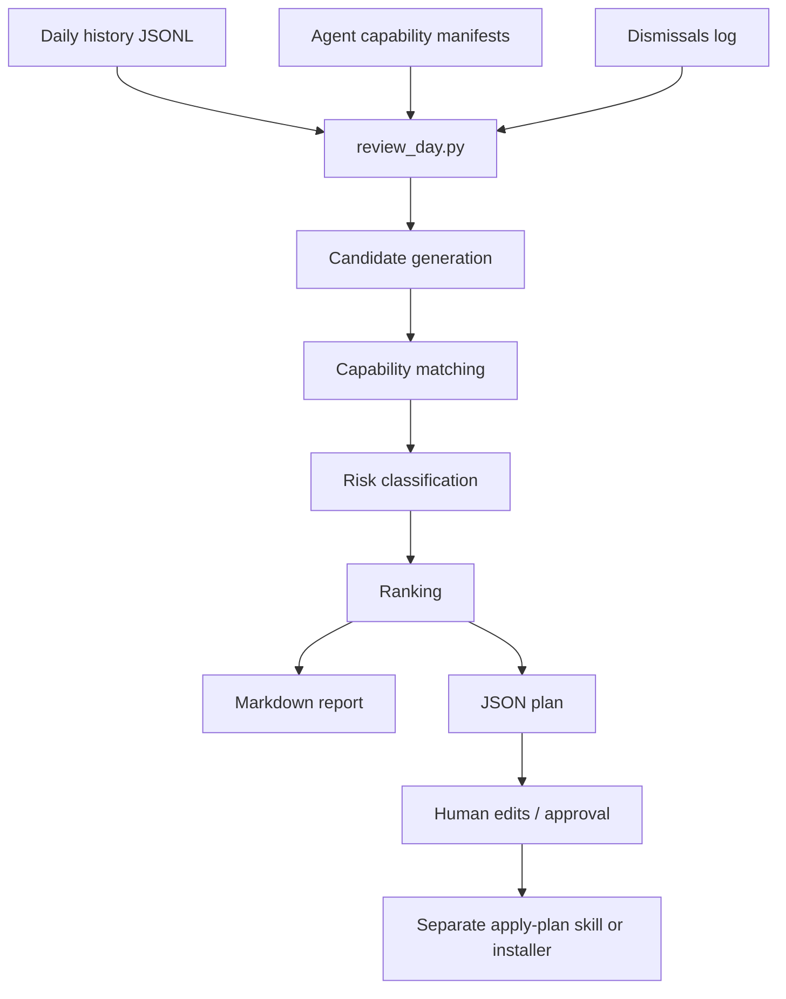

# Chronos Universal

**Turn yesterday’s activity into tomorrow’s highest-leverage recurring agent workflows.**

Chronos Universal is a lean, inspectable agent skill for reviewing a user’s daily history and producing a ranked plan of recurring jobs for the sub-agents already installed in the user’s system.

It is intentionally **not** a large framework. It is a pure, boring-on-purpose review skill:

```text
normalised daily JSONL history + installed agent capability manifests + dismissals log
→ ranked markdown report + machine-readable plan
```

Chronos does not install jobs, trigger agents, expand permissions, or assume named sub-agents. It proposes. A separate installer or human applies approved plans.

> Your daily history is training data for your future operating system.

## What It Does

- Reads a flat JSONL history file such as `~/.history/2026-05-04.jsonl`.
- Reads the installed sub-agent registry from capability manifests.
- Reads `dismissals.jsonl` so it does not repeatedly suggest ideas the user rejected.
- Detects repeated friction, missed follow-ups, stale work, preparation gaps, open loops, and capability gaps.
- Matches each opportunity to existing sub-agents by capability, not by name.
- Emits ranked proposals with evidence, trigger, sub-agent fit, confidence, L0–L5 risk class, success criteria, and retirement conditions.
- Produces both a human-readable Markdown report and a machine-readable JSON plan.

## What It Does Not Do

- It does not write to `crontab`.
- It does not call sub-agents during the review pass.
- It does not create new agents.
- It does not make network calls.
- It does not read outside explicitly provided files.
- It does not perform external, financial, legal, clinical, employment, destructive, or permission-expanding actions.

## Design Philosophy

Chronos is designed around four primitives:

1. **Daily history JSONL** — plain files, line-oriented, append-only, grep-friendly.
2. **Capability manifests** — every installed sub-agent declares `read / reason / write / act` capabilities.
3. **Risk classes** — every proposal receives an L0–L5 risk classification.
4. **Dismissals log** — every rejection is feedback that tunes future ranking.

## Architecture



## Repository Contents

```text
SKILL.md                         Skill instructions and operating contract
scripts/review_day.py            Pure Python implementation
schemas/agent-manifest.schema.json
schemas/proposal.schema.json
schemas/dismissal.schema.json
examples/agent_registry.json
examples/history/2026-05-04.jsonl
examples/dismissals.jsonl
docs/architecture.md
docs/capability-manifest.md
docs/risk-model.md
docs/triggers.md
tests/test_review_day.py
```

## Quick Start

Run the example review:

```bash
python3 scripts/review_day.py review \
  --history examples/history/2026-05-04.jsonl \
  --agents examples/agent_registry.json \
  --dismissals examples/dismissals.jsonl \
  --out-dir .chronos-out
```

You will get:

```text
.chronos-out/review.md
.chronos-out/plan.json
```

Run tests:

```bash
python3 -m unittest discover -s tests
```

## Trigger Types

Cron is supported, but it is not the only primitive.

Chronos proposals can use:

- `cron` — time-based review or digest jobs.
- `event` — when a specific event occurs.
- `threshold` — when a count, age, or score crosses a boundary.
- `manual` — for high-risk ideas that should not recur yet.

Version 1 focuses on cron-safe and review-safe jobs, but the schema is trigger-agnostic from the start.

## Risk Classes

| Level | Meaning | Default Policy |
|---|---|---|
| L0 | Read-only summary | May run automatically |
| L1 | Draft or recommendation only | Scheduled output requires review |
| L2 | Internal write action | Activation requires approval |
| L3 | External communication | Every external action requires approval |
| L4 | Financial, legal, healthcare, employment, or regulated action | Human-in-the-loop always |
| L5 | Destructive, irreversible, or permission-expanding action | Forbidden by default |

## Example Proposal

```json
{
  "id": "p_2026-05-04_open_loop_capture",
  "title": "End-of-day open-loop capture",
  "trigger": {
    "type": "cron",
    "expression": "10 18 * * 1-5",
    "human_readable": "Weekdays at 18:10"
  },
  "selected_agent_id": "agent.task_orchestrator",
  "risk_class": "L1",
  "confidence": 0.83,
  "retirement_conditions": [
    "No useful findings for 14 consecutive runs",
    "User dismisses this proposal 3 times"
  ]
}
```

## Three-Skill Decomposition

Chronos Universal is the first skill in a deliberately separated system:

1. **`review-day`** — review daily history and produce a ranked plan. This repo implements it.
2. **`apply-plan`** — take a human-edited plan and install approved triggers. Separate skill.
3. **`propose-agent`** — suggest a new sub-agent when no existing agent fits. Separate skill.

The action boundary is inviolable: `review-day` never installs, never triggers, never acts.

## License

MIT
